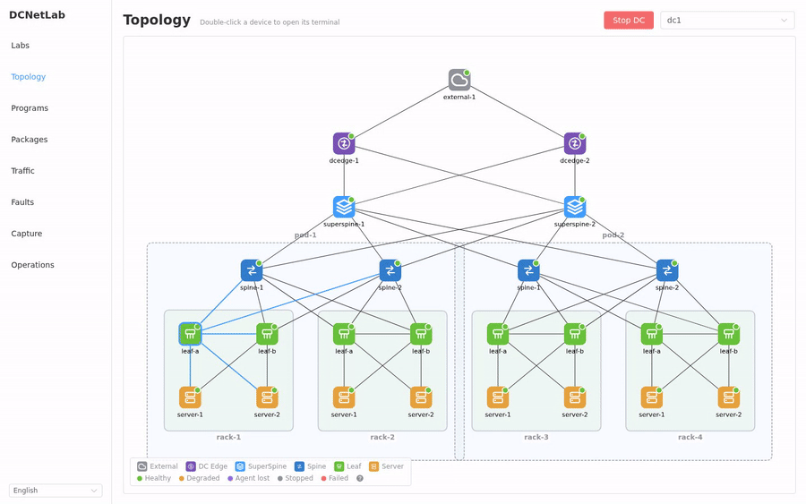
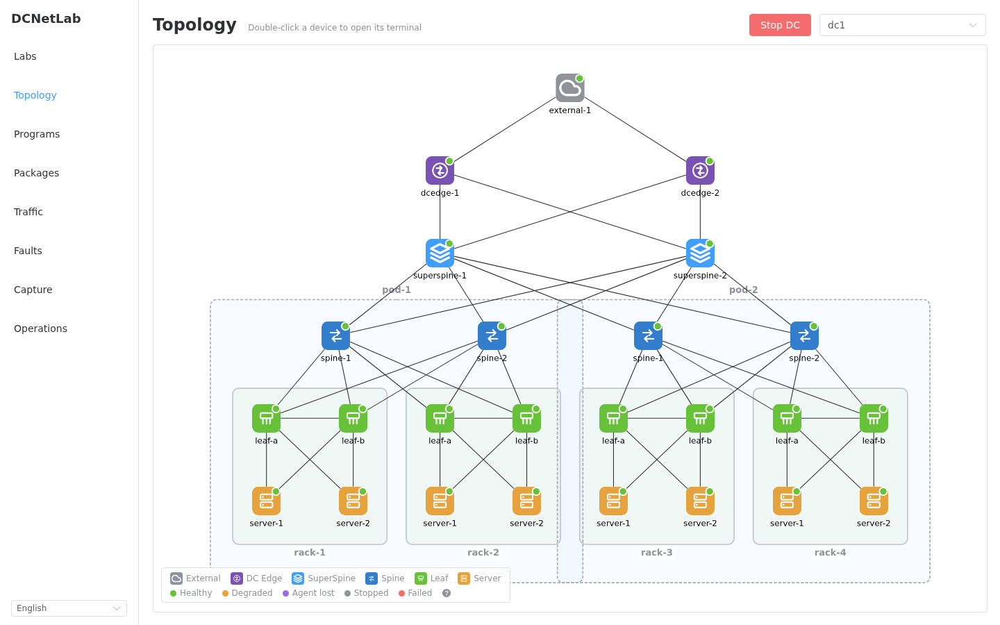
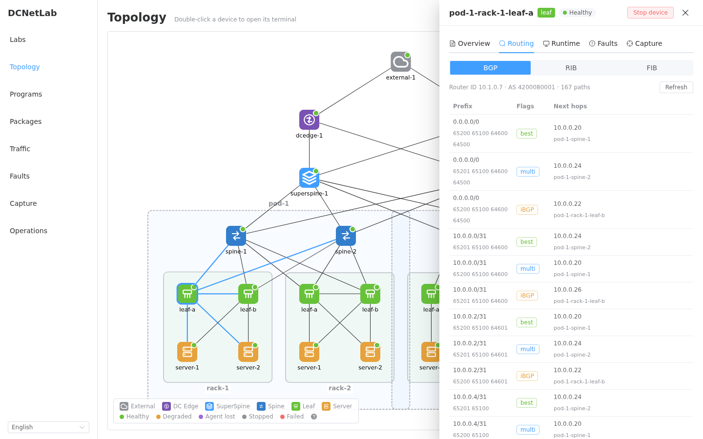
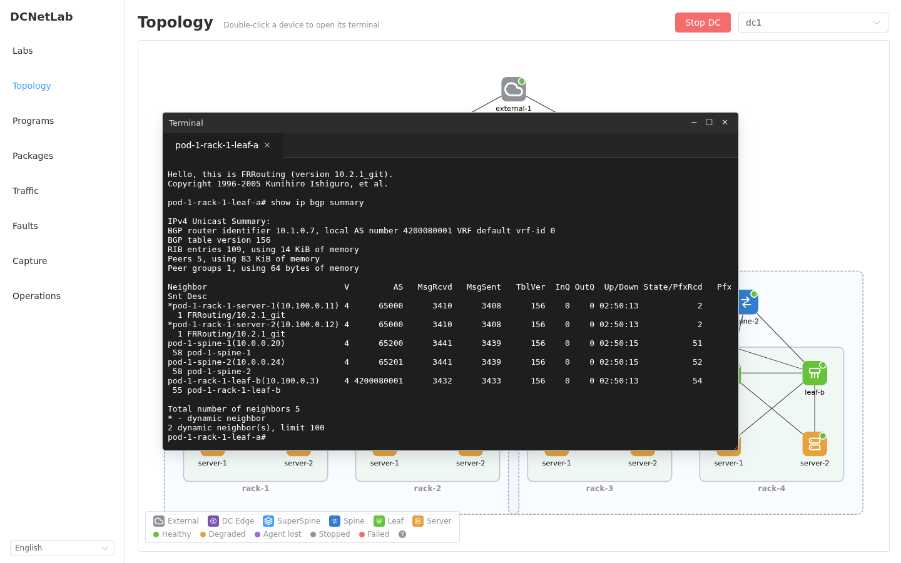
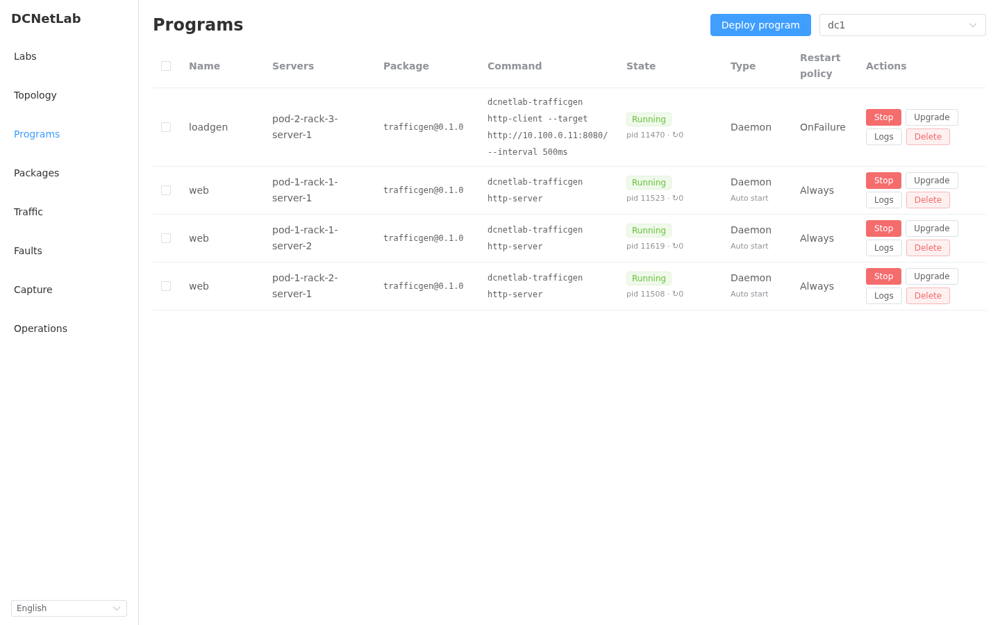

# DCNetLab

> 一台机器，一个命令，一座数据中心。

DCNetLab 是面向数据中心物理网络与虚拟网络的本地化、可视化、可交互模拟平台：声明式地创建 Clos 架构实验拓扑，一键编译部署为跑真实协议栈的容器网络（FRR + Containerlab），在 Web UI 上实时观测 BGP/路由/接口状态、进入设备终端、模拟设备故障，并像运维真实机房一样向服务器分发软件包、部署业务程序。

适用于网络方案验证、故障演练、协议行为研究与教学演示。

<p align="center">
  
</p>
<p align="center"><i>点击设备逐层下钻 BGP Loc-RIB → RIB → FIB → 双击进入 vtysh,一切都是真实协议栈</i></p>

```
Create Lab (Micro / Standard Profile)
      ↓
Plan   自动分配 ASN、Loopback、点到点 /31、机柜 VLAN,生成变更预览
      ↓
Apply  编译 FRR 配置 + Containerlab 拓扑 → 写入 Generation 快照 → 部署 → 控制面/数据面校验
      ↓
运维   拓扑观测、设备终端、启停故障、软件包分发、业务程序部署
```

## 特性

**声明式网络编排**

- Lab → Plan → Apply 三段式变更：先预览后落地，Generation 快照可追溯；IPAM 与按角色分段的 ASN 分配器自动编址。
- 资源模型是唯一事实来源，FRR 配置与 Containerlab 拓扑 YAML 全部为编译产物（Golden 测试保障）。

**真实协议栈与接入模型**

- 标准 Clos 架构 + 机柜接入：每机柜两台 leaf 组成 MLAG 对并作为 VRRP 多活网关，server 以 bond 双归、与 leaf 建 eBGP（peer-group 动态监听）、ECMP 转发；leaf 对 server 只注入默认路由并做前缀过滤，server 路由表保持极简。
- Apply 自带 `ValidateControlPlane`（全部 BGP 会话 Established）与 `ValidateDataPlane`（跨机柜连通性）校验；"设备停止"采用 docker pause 冻结语义，邻居 BGP/VRRP 按真实故障收敛，且已消除管理网默认路由的流量逃逸，故障隔离语义可信。

**可视化与观测**

- 分层 Clos 拓扑画布（Pod/机柜分组框），节点状态角标（运行/未收敛/管理失联/暂停/异常）经 WebSocket 实时推送，状态漂移自动纠正；链路按接口真实观测状态自动置灰。
- 节点详情抽屉：概览（状态速览 + 身份/网络配置）、监控、程序、路由、运行时、故障、抓包多视角，头部健康徽章与画布状态灯同源；路由视角内 BGP Loc-RIB / RIB / FIB 三层逐级下钻，条目漏斗递减，可对照选路与下装全过程。
- 双击设备打开悬浮多标签 Web 终端（交换机进 vtysh、server 进 bash）；DC 与设备粒度一键启停。
- 宿主 Docker/容器运行时导致的网络连接丢失（接口在内核里完全消失，区别于故障注入的管理性关闭）会在拓扑页弹出提示并一键修复，不触碰正在运行的容器与程序。

**故障演练**

- FaultScenario 资源覆盖节点停止/重启（docker pause 语义）、链路/单端口中断（`ip link set` 管理性关闭）、网络损伤（`tc netem` 延迟/抖动/丢包/限速任意组合）；Apply/Recover 显式生命周期，同一目标同时只允许一个生效故障，删除前自动恢复，不留孤儿状态。
- 拓扑图点哪坏哪：节点/链路详情抽屉内置快捷入口，一键注入即生效并联动 Traffic 实时指标，构成"注入故障 → 观测指标掉坑 → 恢复"的完整演示闭环；独立的故障列表页统一管理全部生效中与历史故障。

**流量注入与监控**

- TrafficScenario 资源编排内置 `trafficgen`（http/tcp/udp 六种模式，并发与目标速率可控），收发两端都是跑在 server 上的真实程序；实时速率、错误与 P50/P95/P99 时延曲线连续绘制，与故障注入构成"注入 → 掉坑 → 恢复"的完整演示闭环。
- server 资源监控：CPU/内存/文件系统/磁盘/逐接口网络的实时采样（5 s 自动刷新）与历史曲线（30m–24h 窗口），同时以 Prometheus 兼容的 `/metrics` 端点暴露，可接外部采集体系。

**原生抓包**

- 自研 AF_PACKET 抓包工具预装于交换机镜像、server 经包制品库下发，容器内无需 tcpdump/Wireshark；会话式抓包（协议/地址/端口过滤、时长与包数上限），数据流式回传 controller 解码存储。
- Wireshark 式三栏查看器：包列表 / 协议树 / hex 三栏字段级双向联动高亮，BGP 深度解码到 capability 与路径属性粒度；拓扑图上点节点/链路即可快捷发起。

**服务器工作负载（模拟软件交付）**

- 每台 server 内置 `node-agent` 进程监督，程序语义参考 systemd：`simple`/`oneshot` 类型、开机自启（enable）、重启策略与退避、存活 / 就绪探测（process/tcp/http，存活失败按策略重启）、启动顺序；agent 掉线由平台自动拉起（自愈即"开机"），agent 可达性实时上报拓扑与程序页。
- tar.gz 制品库 + 内部源拉取分发（SHA-256 校验、多版本共存、升级/回滚不重复下载），内置 `trafficgen` 流量应用（http/tcp/udp 六模式）；安装与部署支持按 dc/pod/rack/自选 范围批量下发。
- UI 与容器内 CLI 语义一致：`pkg` 像发行版包管理器一样操作制品库，`program` 管理节点本地程序；拓扑上点击 server 实时查看该机安装的包与运行的程序。

## 界面一览

| 分层 Clos 拓扑画布 | 节点详情抽屉(BGP Loc-RIB) |
|---|---|
|  |  |

| 悬浮 Web 终端(vtysh) | 业务程序编排(批量部署/自启/升级) |
|---|---|
|  |  |

## 快速开始

依赖：Go 1.23+、Node 20+、Docker；部署真实拓扑还需 [containerlab](https://containerlab.dev)（缺省自动降级为 `noop` 运行时，仅生成产物）。

containerlab 依赖 Linux 内核，macOS 上 `make up` 会自动转发到 [OrbStack](https://orbstack.dev) 机器内执行，浏览器访问 `http://dcnetlab.orb.local:8080`。首次使用先装好 OrbStack 再 `make orb-setup`（创建机器并安装 Docker/containerlab/Go/Node，幂等可重复执行）；未安装 OrbStack 或设置 `DCNETLAB_RUNTIME=noop` 时保持本地运行。转发机制与文件共享原理见 [macOS 适配](docs/macos.md)。

```bash
make up                      # 构建三个平面并启动:agent + controller + web
open http://127.0.0.1:8080   # 创建 Lab → Plan → Apply,几分钟后得到一座可交互的数据中心
make down                    # 一键停止
```

一个命令背后是三个独立进程：agent（数据面，驱动 docker/containerlab）、controller（控制面 API）、web（UI 静态托管与反代），彼此通过 localhost gRPC/HTTP 通信——与多机部署使用完全相同的链路，单机只是三者恰好同机。节点镜像（`dcnetlab/frr`、`dcnetlab/server`）在首次 `make up` 时自动构建。

创建 Lab 时可开启"外网访问"：server 的互联网流量沿 leaf → spine → superspine → dcedge（边界 NAT）→ external（运营商出口）穿过整套仿真网络抵达真实互联网，断掉沿途设备即真实断网。需要先 `make edge-image` 构建带 iptables 的 FRR 镜像。

常用命令与配置：

```bash
make dev                     # 开发模式:同一入口,web 反代 Vite 热更新
make images                  # 重建节点镜像(dcnetlab/frr、dcnetlab/server、frr-edge)
scripts/dcnetlab status      # 查看三个进程的运行状态
scripts/dcnetlab logs        # 跟踪 Controller 日志
```

环境变量：`DCNETLAB_LISTEN`（用户入口，默认 `127.0.0.1:8080`）、`DCNETLAB_API_LISTEN`（controller API，默认 `127.0.0.1:8180`）、`DCNETLAB_AGENT_LISTEN`（agent gRPC，默认 `127.0.0.1:50063`）、`DCNETLAB_RUNTIME`（`auto|agent|noop`）、`DCNETLAB_ORB_MACHINE`（macOS 上使用的 OrbStack 机器名，默认 `dcnetlab`）。

API 冒烟（REST 与 gRPC 由同一份 protobuf 生成，经 web 入口或直连 8180 均可）：

```bash
curl -X POST localhost:8080/api/v1/labs -d '{"name":"demo","profile":"micro"}'
curl -X POST localhost:8080/api/v1/labs/<labId>/plans
curl -X POST localhost:8080/api/v1/plans/<planId>/apply
curl localhost:8080/api/v1/operations/<opId>
```

### 独立部署（控制面 / 数据面分机）

三个组件天然支持拆开部署，典型形态是把数据面放到一台专用 Linux 机器上：

```bash
# 数据面机器(装有 docker + containerlab):
dcnetlab-agent --listen 0.0.0.0:50063 \
  --repo-upstream <controller-ip>:50062     # 中转容器的软件包拉取

# 控制面机器:
dcnetlab-controller --listen 127.0.0.1:8180 --agent <agent-ip>:50063

# UI(可与控制面同机):
dcnetlab-web --listen 0.0.0.0:8080 --controller http://127.0.0.1:8180 --web-dir web/dist
```

controller 对容器内 node-agent 的访问经 agent 的拨号代理转发，容器的软件包拉取经 agent 的 repo 反代回源到 controller，因此跨机部署不要求打通容器管理网。agent 的 gRPC 为明文无认证，仅应暴露在可信内网。详见[架构文档](docs/architecture.md)。

## 架构

控制面与数据面进程级分离，单机与多机共用同一条链路（完整架构见[架构文档](docs/architecture.md)）：

- **controller（控制面）**：Go 模块化单体（[Kratos](https://go-kratos.dev/) 框架），protobuf 为 API 唯一事实来源（REST 8180 / gRPC 9090 同源生成），SQLite 持久化，异步 Operation 执行变更；分层严格单向 service → biz → data。不直接接触 docker/containerlab。
- **agent（数据面）**：跑在容器宿主机上的 daemon，通过 gRPC 接收 controller 的部署产物与运行时操作（deploy/exec/故障注入），本地驱动 docker/containerlab；同时代理 controller 到容器管理网的访问与容器的软件包回源拉取。
- **编译器**：资源模型 → FRR 配置 + Containerlab 拓扑，全部产物可重放；Runtime Driver 接口抽象 agent / noop 两种运行时，Deploy 随 RPC 携带产物文件。
- **node-agent**：每台 server 容器内的进程监督 daemon（烤入 `dcnetlab/server` 镜像，等价 OS 预装），controller 经 agent 拨号代理以 gRPC 驱动，无任意命令接口；抓包工具在交换机镜像内预装，在 server 上经包制品库下发。
- **web**：独立静态服务托管 Vue 3 构建产物并反代 API/WebSocket 到 controller，浏览器只面对一个源；前端 Vue 3 + TypeScript + Pinia + Element Plus + Cytoscape.js，vue-i18n 国际化（简体中文/English）。

## 目录结构

```
api/dcnetlab/v1/           protobuf API 定义(REST + gRPC 的唯一事实来源)
api/agent/v1/              数据面 agent 的 gRPC API(controller ↔ 宿主机)
api/nodeagent/v1/          node-agent 的 gRPC API(controller ↔ 容器内 agent)
pb/                        buf generate 生成的 Go 代码(勿手改)
internal/                  跨面共享的契约:model(资源模型)、nodeagentapi(线上常量)、
                           runtime(Driver 接口与 noop 实现)
controller/                控制面
  cmd/controller/          controller 入口(main + wire 装配)
  internal/biz/            业务层 usecase(lab/plan/topology/operation/program/package)
  internal/data/           数据层(SQLite,与 biz 同构拆分)
  internal/service/        protobuf 服务实现(pb ↔ model 转换)
  internal/server/         Kratos HTTP/gRPC 传输装配(含包制品库)
  internal/agentdriver/    Runtime Driver 的 gRPC 客户端(拨向数据面 agent)
  internal/allocator/      IPAM 与 ASN 分配器
  internal/topology/       Profile → 节点/链路构建
  internal/compiler/       FRR 配置与 Containerlab 拓扑编译(Golden 测试)
  internal/operation/      异步 Operation 执行器
  internal/observer/       运行态采集与状态自愈
  internal/capture/        抓包会话管理与协议解码
agent/                     数据面
  cmd/agent/               宿主机 daemon 入口(gRPC :50063)
  internal/server/         Agent gRPC 服务端与 repo 反代
  internal/clab/           containerlab/docker CLI 驱动(runtime.Driver 实现)
nodeapps/                  被交付进仿真容器的应用(镜像预装或包制品库下发)
  cmd/node-agent/          server 容器内进程监督 daemon 入口(gRPC :50061)
  cmd/node-cli/            容器内运维 CLI 入口(多调用二进制,pkg/program 为其软链)
  cmd/trafficgen/          内置流量收发应用入口(作为 builtin 包运行)
  cmd/capture/             AF_PACKET 抓包工具入口(交换机镜像预装/server 包下发)
  internal/                node-agent 存储/监督/gRPC、CLI 命令、trafficgen/capture 实现
web/                       Vue 3 前端;server/ 是静态托管 + API 反代的 Go 入口
build/                     节点镜像 Dockerfile(frr / server / frr-edge)
scripts/                   一键启停与工具链初始化脚本
docs/                      PRD、技术设计、架构、node-agent 与代码规范文档
```

各平面内部遵循 [kratos-layout](https://github.com/go-kratos/kratos-layout)，wire 依赖注入按层聚合 ProviderSet；`controller/internal`、`agent/internal` 与 `nodeapps/internal` 由 Go internal 规则强制互不可见，跨面只能走 proto 契约与根 `internal/` 共享包。

## 开发

```bash
make init            # 安装工具链(buf / protoc 插件 / kratos / wire / golangci-lint,版本固定)
make api             # 修改 proto 后重新生成 pb/
make wire            # 修改 provider 后重新生成 wire_gen.go
make build test      # 构建 + 单元/集成测试
make lint            # golangci-lint + 风格检查,要求零告警
make golden          # 编译器模板变更后更新 Golden 基线
```

proto 依赖（`google/api` 注解）由 buf 从 BSR 拉取并经 `buf.lock` 锁定，仓库不落 third_party。提交前 `make build test lint` 必须全部通过；代码与提交规范见 docs/ 下的 style 文档。

## 文档

| 文档 | 内容 |
|---|---|
| [PRD](docs/PRD.md) | 需求与产品定义 |
| [架构](docs/architecture.md) | 控制面/数据面分离架构、组件与端口、部署形态 |
| [技术设计](docs/design.md) | 架构、网络模型与迭代规划 |
| [node-agent](docs/node-agent.md) | agent 运行逻辑与容器内 `pkg`/`program` 命令参考 |
| [macOS 适配](docs/macos.md) | OrbStack 转发运行时的实现原理与图示 |
| [开发进展](docs/progress.md) | 各迭代交付明细与关键经验 |

## Roadmap

按设计文档迭代顺序推进：Daemon 框架与 Pingmesh、Package 格式扩展（deb/OCI）与镜像预装通道、可视化扩容与 Rollback、VPC/VXLAN、EIP。
