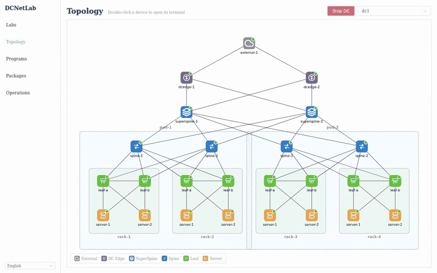
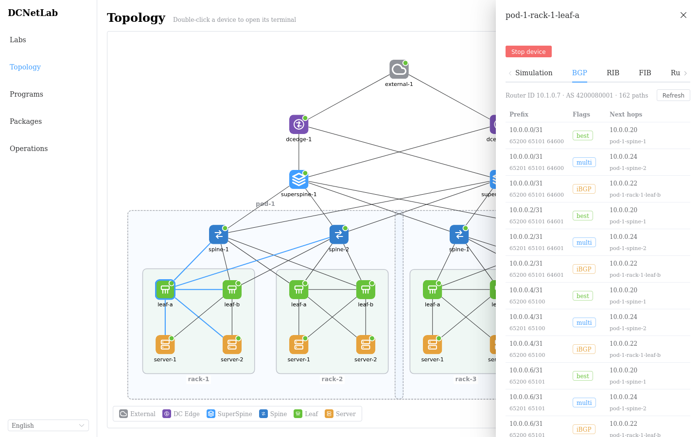

# DCNetLab

> 一台机器，一个命令，一座数据中心。

DCNetLab 是面向数据中心物理网络与虚拟网络的本地化、可视化、可交互模拟平台：声明式地创建 Clos 架构实验拓扑，一键编译部署为跑真实协议栈的容器网络（FRR + Containerlab），在 Web UI 上实时观测 BGP/路由/接口状态、进入设备终端、模拟设备故障，并像运维真实机房一样向服务器分发软件包、部署业务程序。

适用于网络方案验证、故障演练、协议行为研究与教学演示。

<p align="center">
  
</p>
<p align="center"><i>点击设备查看 BGP Loc-RIB → 双击进入 vtysh,一切都是真实协议栈</i></p>

```
Create Lab (Micro / Standard Profile)
      ↓
Plan   自动分配 ASN、Loopback、点到点 /31、机柜 VLAN,生成变更预览
      ↓
Apply  编译 FRR 配置 + Containerlab 拓扑 → 写入 Generation 快照 → 部署 → 控制面/数据面校验
      ↓
运维   拓扑观测、设备终端、启停故障、软件包分发、业务程序部署
```

## 特性

**声明式网络编排**

- Lab → Plan → Apply 三段式变更：先预览后落地，Generation 快照可追溯；IPAM 与按角色分段的 ASN 分配器自动编址。
- 资源模型是唯一事实来源，FRR 配置与 Containerlab 拓扑 YAML 全部为编译产物（Golden 测试保障）。

**真实协议栈与接入模型**

- 标准 Clos 架构 + 机柜接入：每机柜两台 leaf 组成 MLAG 对并作为 VRRP 多活网关，server 以 bond 双归、与 leaf 建 eBGP（peer-group 动态监听）、ECMP 转发；leaf 对 server 只注入默认路由并做前缀过滤，server 路由表保持极简。
- Apply 自带 `ValidateControlPlane`（全部 BGP 会话 Established）与 `ValidateDataPlane`（跨机柜连通性）校验；"设备停止"采用 docker pause 冻结语义，邻居 BGP/VRRP 按真实故障收敛，且已消除管理网默认路由的流量逃逸，故障隔离语义可信。

**可视化与观测**

- 分层 Clos 拓扑画布（Pod/机柜分组框），节点状态角标（运行/未收敛/暂停/异常）经 WebSocket 实时推送，状态漂移自动纠正。
- 节点五视角抽屉：模拟视角 / BGP Loc-RIB / RIB / FIB / 运行时，路由条目逐层漏斗递减，可对照选路与下装全过程。
- 双击设备打开悬浮多标签 Web 终端（交换机进 vtysh、server 进 bash）；DC 与设备粒度一键启停。

**服务器工作负载（模拟软件交付）**

- 每台 server 内置 `node-agent` 进程监督，程序语义参考 systemd：`simple`/`oneshot` 类型、开机自启（enable）、重启策略与退避；agent 掉线由平台自动拉起（自愈即"开机"）。
- tar.gz 制品库 + 内部源拉取分发（SHA-256 校验、多版本共存、升级/回滚不重复下载），内置 `trafficgen` 流量应用（http/tcp/udp 六模式）；安装与部署支持按 dc/pod/rack/自选 范围批量下发。
- UI 与容器内 CLI 语义一致：`pkg` 像发行版包管理器一样操作制品库，`program` 管理节点本地程序；拓扑上点击 server 实时查看该机安装的包与运行的程序。

## 界面一览

| 分层 Clos 拓扑画布 | 节点多视角抽屉(BGP Loc-RIB) |
|---|---|
|  |  |

| 悬浮 Web 终端(vtysh) | 业务程序编排(批量部署/自启/升级) |
|---|---|
|  |  |

## 快速开始

依赖：Go 1.23+、Node 20+、Docker；部署真实拓扑还需 [containerlab](https://containerlab.dev)（缺省自动降级为 `noop` 运行时，仅生成产物）。

containerlab 依赖 Linux 内核，macOS 上 `make up` 会自动转发到 [OrbStack](https://orbstack.dev) 机器内执行，浏览器访问 `http://dcnetlab.orb.local:8080`。首次使用先装好 OrbStack 再 `make orb-setup`（创建机器并安装 Docker/containerlab/Go/Node，幂等可重复执行）；未安装 OrbStack 或设置 `DCNETLAB_RUNTIME=noop` 时保持本地运行。

```bash
make up                      # 构建后端 + 前端,Controller 托管 UI
open http://127.0.0.1:8080   # 创建 Lab → Plan → Apply,几分钟后得到一座可交互的数据中心
make down                    # 一键停止
```

创建 Lab 时可开启"外网访问"：server 的互联网流量沿 leaf → spine → superspine → dcedge（边界 NAT）→ external（运营商出口）穿过整套仿真网络抵达真实互联网，断掉沿途设备即真实断网。需要先 `make edge-image` 构建带 iptables 的 FRR 镜像。

常用命令与配置：

```bash
scripts/dcnetlab up --dev    # 开发模式:Controller + Vite 热更新(http://localhost:5173)
scripts/dcnetlab status      # 查看运行状态
scripts/dcnetlab logs        # 跟踪 Controller 日志
```

环境变量：`DCNETLAB_LISTEN`（默认 `127.0.0.1:8080`）、`DCNETLAB_RUNTIME`（`auto|containerlab|noop`）、`DCNETLAB_ORB_MACHINE`（macOS 上使用的 OrbStack 机器名，默认 `dcnetlab`）。

API 冒烟（REST 与 gRPC 由同一份 protobuf 生成）：

```bash
curl -X POST localhost:8080/api/v1/labs -d '{"name":"demo","profile":"micro"}'
curl -X POST localhost:8080/api/v1/labs/<labId>/plans
curl -X POST localhost:8080/api/v1/plans/<planId>/apply
curl localhost:8080/api/v1/operations/<opId>
```

## 架构

- **Controller**：Go 模块化单体（[Kratos](https://go-kratos.dev/) 框架），protobuf 为 API 唯一事实来源（REST 8080 / gRPC 9090 同源生成），SQLite 持久化，异步 Operation 执行变更；分层严格单向 service → biz → data。
- **编译器**：资源模型 → FRR 配置 + Containerlab 拓扑，全部产物可重放；Runtime Driver 抽象 containerlab / noop 两种运行时。
- **node-agent**：每台 server 容器内的进程监督 daemon（单文件 bind mount 交付，等价 OS 预装），Controller 经管理网 gRPC 驱动，无任意命令接口。
- **前端**：Vue 3 + TypeScript + Pinia + Element Plus + Cytoscape.js，vue-i18n 国际化（简体中文/English）。

## 目录结构

```
api/dcnetlab/v1/       protobuf API 定义(REST + gRPC 的唯一事实来源)
api/nodeagent/v1/      node-agent 的 gRPC API(Controller ↔ 容器内 agent)
pb/                    buf generate 生成的 Go 代码(勿手改)
cmd/controller/        Controller 入口(main + wire 装配)
serverapps/            模拟 server 内运行的程序(独立子树,controller 不可引用其 internal)
  node-agent/          进程监督 daemon 入口(gRPC :50061)
  node-cli/            容器内运维 CLI 入口(多调用二进制,pkg/program 为其软链)
  trafficgen/          内置流量收发应用入口(作为 builtin 包运行)
  internal/            agent 存储/监督/gRPC、CLI 命令、trafficgen 各模式实现
internal/agentapi/     Controller 与 agent 共享的线上契约常量
internal/model/        资源模型(唯一事实来源)
internal/biz/          业务层 usecase(lab/plan/topology/operation/program/package)
internal/data/         数据层(SQLite,与 biz 同构拆分)
internal/service/      protobuf 服务实现(pb ↔ model 转换)
internal/server/       Kratos HTTP/gRPC 传输装配(含 Web UI 托管与包仓库)
internal/allocator/    IPAM 与 ASN 分配器
internal/topology/     Profile → 节点/链路构建
internal/compiler/     FRR 配置与 Containerlab 拓扑编译(Golden 测试)
internal/operation/    异步 Operation 执行器
internal/runtime/      Runtime Driver(containerlab / noop)
internal/observer/     运行态采集与状态自愈
web/                   Vue 3 前端
scripts/               一键启停与工具链初始化脚本
doc/                   PRD、技术设计、node-agent 与代码规范文档
```

目录组织遵循 [kratos-layout](https://github.com/go-kratos/kratos-layout)，wire 依赖注入按层聚合 ProviderSet。

## 开发

```bash
make init            # 安装工具链(buf / protoc 插件 / kratos / wire / golangci-lint,版本固定)
make api             # 修改 proto 后重新生成 pb/
make wire            # 修改 provider 后重新生成 wire_gen.go
make build test      # 构建 + 单元/集成测试
make lint            # golangci-lint + 风格检查,要求零告警
make golden          # 编译器模板变更后更新 Golden 基线
```

proto 依赖（`google/api` 注解）由 buf 从 BSR 拉取并经 `buf.lock` 锁定，仓库不落 third_party。提交前 `make build test lint` 必须全部通过；代码与提交规范见 doc/ 下的 style 文档。

## 文档

| 文档 | 内容 |
|---|---|
| [PRD](doc/PRD.md) | 需求与产品定义 |
| [技术设计](doc/design.md) | 架构、网络模型与迭代规划 |
| [node-agent](doc/node-agent.md) | agent 运行逻辑与容器内 `pkg`/`program` 命令参考 |
| [开发进展](doc/progress.md) | 各迭代交付明细与关键经验 |

## Roadmap

按设计文档迭代顺序推进：Daemon 框架、Package 格式扩展（deb/OCI）与镜像预装通道、Traffic 编排、AF_PACKET 抓包、故障注入、可视化扩容、VPC/VXLAN、EIP。
